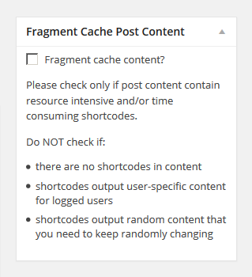
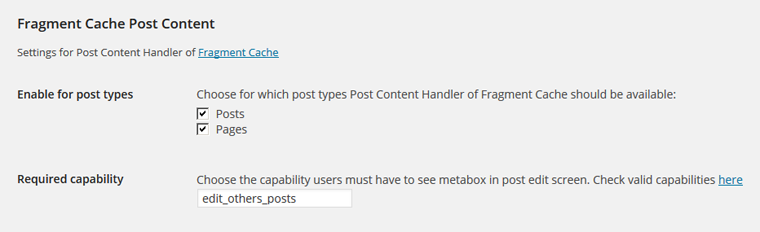
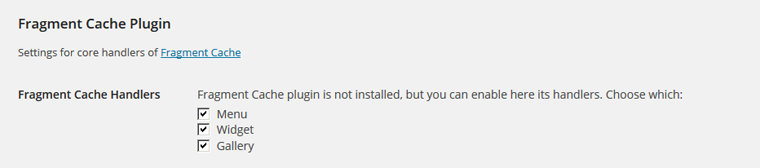

Post Content Handler for Fragment Cache
---------------------------------------

Post Content Handler for Fragment Cache is an extension of the awesome WordPress plugin ["Fragment Cache"](https://github.com/Rarst/fragment-cache) by [Andrey "Rarst" Savchenko](http://www.rarst.net/).

Fragment Cache allows partial and async caching of heavy front-end elements. It currently supports caching navigation menus, widgets, and galleries.

Post Content Handler for Fragment Cache (PCHFC) adds an additional "cache handler" to allow caching of post content in singular views.

PCHFC was realized for a client site, where a premium theme forced to build page content using an insane number of nested shortcodes, ending up in a quite slow page loading.

Full-page caching was not an option, because in that site there are (outside of post content) a lot of user-specific stuff.

Thanks to Fragment Cache I was able to coded this handler that allowed me to successfully cache post content, without affecting the rest of the page.

Of course, posts having simple, text only content should **not** be cached, otherwise page loading time increase instead of decrease: for this reason the plugin add a metabox in the post edit screen that allow to enable or disable the post content caching.

A client requirement was that this metabox should be only visible to users with specific capability. So I added a setting page (accessible from Settings -> Fragment Cache) where is possible to change the capability required to view the metabox and so enable or disable post content fragment caching.

As you can see in the screenshot, another option is available: the possibility to choose for which post types the post content caching should be available. When custom post types are registered, they are also visible in that setting, but unselected by default.

###Standalone Mode###

As said, PCHFC is just an extension of Fragment Cache, however, even if that plugin is not installed and activated in WordPress,  thanks to Fragment Cache [Composer](https://getcomposer.org/) support, a copy of the plugin is "embedded" in Post Content Handler folder and so PCHFC can work in "standalone" mode: i.e. you can install PCHFC without having to install Fragment Cache.

When Fragment Cache is installed, it enables the 3 core handlers:
 - Menu
 - Widget
 - Gallery

and they can only disabled via code. See [docs](https://github.com/Rarst/fragment-cache#how-to-disable-caching) for more info.

When in standalone mode, PCHFC adds an additional setting that allow to enable / disable the 3 core handlers.

#Installation#

PCHFC is a [Composer](https://getcomposer.org/) package and can be installed in plugin directory via:

    composer create-project giuseppe-mazzapica/fc-post-content-handler --no-dev

#License#

Post Content Handler for Fragment Cache is released under GPLv2+, just like Fragment Cache.
Please refers to [Fragment Cache readme](https://github.com/Rarst/fragment-cache#license-info) for license of 3rd parties code required by Fragment Cache.

